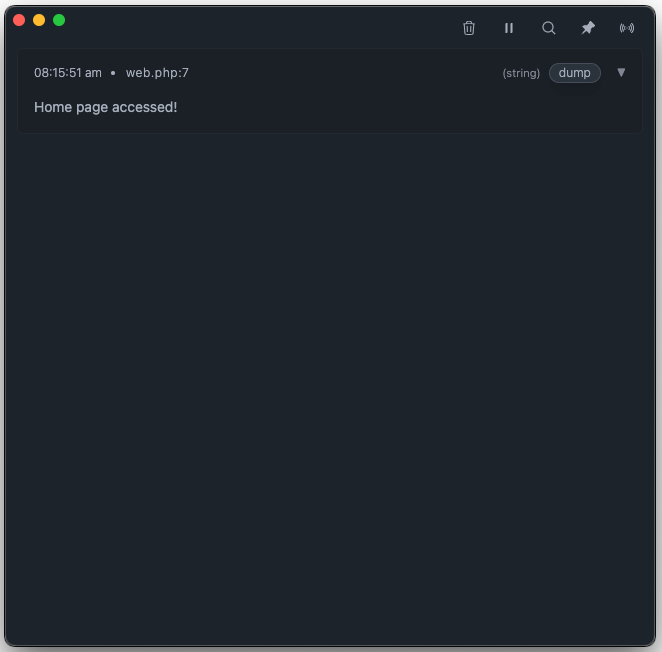

<p align="center">
  
</p>
<h1 align="center">LaraDumps Core</h1>
<div align="center">
  <h4><a href="https://laradumps.dev/get-started/installation.html" target="_blank">Download the App</a></h4>
  <sub>Available for Windows, Linux and macOS.</sub>
  <br />
  <br />
  <p>
    <a href="https://laradumps.dev"> 📚 Documentation </a>
  </p>
</div>
 <br/>
<div align="center">
  <p align="center">
    <a href="https://packagist.org/packages/laradumps/laradumps-core">
      
    </a>
    <a href="https://packagist.org/packages/laradumps/laradumps-core">
      
    </a>
    <a href="https://github.com/laradumps/laradumps-core/actions">
        
    </a>
    <a href="https://packagist.org/packages/laradumps/laradumps-core">
      
    </a>
  </p>
</div>

### 👋 Hello Dev,

<br/>

LaraDumps is a modern, feature-rich debugging tool that makes PHP development a breeze.

When using LaraDumps, the outcome of your debug dump is presented in a separate desktop application rather than in your browser or command-line interface, ensuring that your application flow remains uninterrupted.

### Key Features

LaraDumps goes beyond dumping variables. In addition to functions similar to `var_dump()`, LaraDumps provides tools for validating JSON, searching for substrings, clocking execution time, and a convenient way to view `phpinfo()` output and [much more...](https://laradumps.dev/debug/reference-sheet.html)

#### Example

Here's an example of LaraDumps `ds()` debug function in the project's home page.

```php
<?php
  ds('Home page accessed!');
?>
<!DOCTYPE html>
<html>
    <head>
```

By opening this page in your browser, the desktop App will display the dump, and the page will be loaded without any interference.

<p align="center">
  
</p>

<br/>

### Get Started

#### Requirements

PHP 8.1+

Developing a Laravel project? LaraDumps has dedicated Laravel package available at the [laradumps/laradumps](https://github.com/laradumps/laradumps) repository.

#### Installation

Please take a moment to check our [installation page](https://laradumps.dev/get-started/installation.html) at our documentation website.

<br/>

### Credits

LaraDumps is a free open-source project, and it was inspired by [Spatie Ray](https://github.com/spatie/ray).

- Author: [Luan Freitas](https://github.com/luanfreitasdev)

- Logo by [Vitor S. Rodrigues](https://github.com/vs0uz4)

- Thanks to all [contributors](http://github.com/laradumps/laradumps/contributors)
